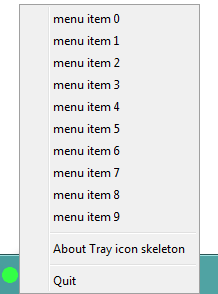

tray-icon-skeleton
==================

This skeleton project of a simple self-executable jar displaying a simple tray icon menu

## Customize the tray icon

Edit the pom.xml file to add dependencies and customize the build and the application name.  
Add and customize sources and resources into `src/main/java` and `src/resources` directories.

## Build the tray icon self-executable jar

To build the tray icon executable jar file with all dependencies, use this maven command: `mvn clean install`

## Launch the tray icon self-executable jar

Just execute this jar file: `target/tray-icon-skeleton-1.0-SNAPSHOT-jar-with-dependencies.jar`.  
A tray icon with these menus must be displayed like this screenshot:  

